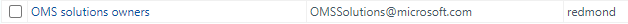

# Description

The purpose of this TSG is to explain the procedure of updating ODS (OMS Data Service) Configuration related to  Detection Team Service when a new OMS Service is deploy in a new Region by the OMS Team (aka. Log Analytics Team).

Detection System is using the OMS Services to collect Azure customers Servers (Win, Linux and Antimalware) Raw security events (e.g. "AuditD" for Linux and EventLog security events for Windowns). By preforming an integration with the ODS code for new regions, the ODS will then able to send the data to relevant Event Hub. The Scuba Service then will pull the Data send by the OMS from the Event Hub and transfer it into the ASC system (Detection Systems and Kusto DBs). The Detection Services will use this raw events to generate the alerts coming from our Azure Customers.

High Level Description of the data flow: 

**NOTE:** Each EU and Non Public regions has the same flow with their own components.

# Prerequisite for the Code integration

## Add your self to OMS Solution owner Distribution List (One time only) 

1) Add your self to the Distribution List of OMS solution group, so you  will be updated on new ODS regions been deployed:
* Join to: OMS solutions owners via IdmWeb: 
[OMS Solution Owner](https://idweb/IdentityManagement/aspx/Groups/AllDLs.aspx?searchtype=31b7e219-b01e-4aa6-9e1a-8823a079b4c4&content=OMS%20solutions%20owners)

## Receiving new ODS regions deployment plan status mail from OMS Solution owner team

1) OMS Team will issue a Mail with OMS new Region/s deployment timeline. In that mail they will indicate the ODS Owner contact person and their deployment timeline. You will want to issue the Detection additional code to their code in the right time (Not too soon and not too late), Sync with the ODS contact engineer for the right time to preform the Pull Request.

* See Example Mail: [Example Mail from LA team(OMS) - new ODS region deployment plan](./.attachments/ODS_Region_Mail_Example.png)

* you can also check the OMS Region Rollout plan Excel: [Region Rollout Plan](https://microsoft.sharepoint.com/teams/OpInsights/_layouts/15/Doc.aspx?sourcedoc={01aca1b5-f7c9-4694-9dc7-aa364ea61afe}&action=edit&wd=target%28Region%20Buildout%20Status.one%7C8574921f-6c3c-4a67-86a4-42122c937b32%2FRegion%20Rollout%20Plan%7Ce34a7bd6-2ac4-49f6-a794-c76d1a8bbe3f%2F%29)

## Get Scuba KeyVault [(See Blue path No. 1 in Diagram)](#Description)

1) Make sure you have the KeyVault URL for the **Scuba** Event Hub before starting, we will use it later for the ODS Configuration.

<table>
  <tbody>
    <tr>
      <th align="left">New Region</th>
      <th align="left">Scuba Event Hub Key Vault</th>
    </tr>
    <tr>
      <td>New Public Region Europe</td>
      <td align="left">"$kv:[secret]:nrt-asc-weu-prod.vault.azure.net/secrets/ods-scuba-weu-prod-01$"</td>
    </tr>
    <tr>
      <td>New Public Region Others</td>
      <td align="left">"$kv:[secret]:nrt-asc-eus-prod.vault.azure.net/secrets/ods-scuba-eus-prod-01$"</td>
    </tr>
    <tr>
      <td>Non Public Regions</td>
      <td align="left">Ask Scuba team for a KV in that region</td>
    </tr>
  </tbody>
</table>

- **Note**: To find if Region is in Europe or Rest of the world check this link: [Regions Location](https://azure.microsoft.com/en-us/global-infrastructure/locations/)
   

## Get Antimalware KeyVault 

[(See Green path No. 2 in Diagram)](#Description)

1) Part of the Detection ODS Configuration is the Antimalware enable, for it we will need KeyVault which you will get from our **Detection** Team.

<table>
  <tbody>
    <tr>
      <th align="left">New Region</th>
      <th align="left">AntiMalware Event Hub Key Vault</th>
    </tr>
    <tr>
      <td>New Public Region Europe</td>
      <td align="left">"$kv:[secret]:am-prod-02-weu.vault.azure.net/secrets/AntimalwareThreatsEventHubConnectionString-Send-Primary$"</td>
    </tr>
    <tr>
      <td>New Public Region Others</td>
      <td align="left">"$kv:[secret]:am-prod-01-cus.vault.azure.net/secrets/AntimalwareThreatsEventHubConnectionString-Send-Primary$"</td>
    </tr>
    <tr>
      <td>Non Public Regions</td>
      <td align="left">Ask Nadav Wolfin from Detection team for KeyVault</td>
    </tr>
  </tbody>
</table>
  

## Get WDATF KeyVault

[(See Green path No. 3 in Diagram)](#Description)

Make sure you have the KeyVault URL for the **WDATP** Event Hub before starting, we will use it later for the ODS Configuration.

<table>
  <tbody>
    <tr>
      <th align="left">New Region</th>
      <th align="left">WDATP Event Hub Key Vault</th>
    </tr>
    <tr>
      <td>New Public Region Europe</td>
      <td align="left">"$kv:[secret]:wcd-partners-prd.vault.azure.net/secrets/sb-omstelemetryeh-send-neu$||$kv:[secret]:wcd-partners-prd.vault.azure.net/secrets/sb-omstelemetryeh-send-weu$",</td>
    </tr>
    <tr>
      <td>New Public Region Others</td>
      <td align="left">"$kv:[secret]:wcd-partners-prd.vault.azure.net/secrets/sb-omstelemetryeh-send-eus$||$kv:[secret]:wcd-partners-prd.vault.azure.net/secrets/sb-omstelemetryeh-send-cus$||$kv:[secret]:wcd-partners-prd.vault.azure.net/secrets/sb-omstelemeh-send-eus$",</td>
    </tr>
    <tr>
      <td>Non Public Regions</td>
      <td align="left">Ask WDATP team for KeyVault - Vladimir Skabelin <vskab@microsoft.com></td>
    </tr>
  </tbody>
</table>
  

**NOTICE**: Make sure that all KeyVault owners added required permissions to the secrets they apply to you.

# Create ODS Pull Request 

1. Edit the LogAlaytics ODS new Region JSON file: 

A. Locate the new ODS Region json file by entering the following Repo link (**src --> Test --> Deployment --> ServiceGroupRoot**): [LogAnalytics ODS Repo](https://msazure.visualstudio.com/One/_git/mgmt-loganalytics-ODS?path=%2Fsrc%2FTest%2FDeployment%2FServiceGroupRoot)

B. Edit relevant JSON file of the new Region with the following code parameters. 

Edit first 2 **Antimalware** parameters. See example:

    // Enabled Antimalware pipeline
    "ServiceBus.RomeDetectionAMEnabled": "true",
    
    // URL to KeyVault/Secret that holds the ConnectionString to Antimalware’s EventHub: AM deployment (Detection)
    "ServiceBus.RomeDetectionAMEventHubConnectionStrings": *Add the relevant secret URL, base on the Antimalware table above.
  

Edit the 3 next **Scuba** paramters. See Example:

    // Enable Windows pipeline
    "ServiceBus.RomeDetectionEnabled": "true",
    
    // Enable Linux Pipeline
    "ServiceBus.RomeDetectionLinuxAuditV2Enabled": "true",
  
    // URL to KeyVault/Secret that holds the ConnectionString to Scuba EventHub (support Win / Linux) – Scuba should provide the KeyVault + EventHub
    
    "ServiceBus.ScubaInMemIngestorMultiPipelineConnectionStrings": *Add the relevant secret URL, base on the Scuba table above.
    

Edit the 2 next **WDATF** paramters, See example:

    // Enabled WDATF pipeline
    "ServiceBus.WdAtpDetectionEnabled": "true",
    
    // URL to KeyVault/Secret that holds the ConnectionString to WDATF Scuba EventHub: WDATF Team (WDATF)
    "ServiceBus.WdAtpDetectionEventHubConnectionStrings": *Add the relevant secret URL, base on the WDATP table above.

C. **Commit** your changes to a **new branch** and ask for Pull Request from LogAnalytics team (OMS). It will automatically added the relevant reviewer, however it is recommended to also send a mail to the relevant ODS code owner.

# Create Detection-AlertCollector Pull Request 

1. **StoreManager** - Update the new Regions in the Detection StoreManager service

    A. Go to: **Rome-Detection-AlertCollector** Repo and under **/src/StoreManager/AlertCollector/Processing/Enrichment/Configuration/** Edit the **OmsWorkspaceInfoConfiguration.cs** file by adding the new regions to it:

B. **Commit** to your branch and ask for **Pull Request** from Detection Team.

# Confirm Scuba code is updated 

1. Confirm that the Scuba team update there source code with the new region in the following repo path:

	Note: If the Scuba team did not update their DetectionsPublisher service with the new regions contact them and check when it will be ready.

 # Test the new Region/s

   In order to verify that everything is running correctly, we will need to prefrom a basic test to check Alerts are coming from the new Regions.

- Note: Prerequisite to the Tests is ODS approve the your PR and Scuba reciving raw events to thier Event Hub.

To do that we will need to prefrom the following 3 tasks:

## Setup a new Log Analytics Workspace

1. Create a new **log analytics workspace** in the **new region**, 

you can use one of the following Test Subscriptions for creating it: 

After creating the Log Analytics Workspace in the new Region make sure you install the following 2 solutions on them: 
* Azure Security Center
* Antimalware Assessment

To install the 2 solutions go to **Configure monitoring Solution** under the **Overview** page of the **Log Analytics Workspace**:

See Example

Click the **+Add** button

Select and Install the **Azure Security Center** feature

After that do the same for the **Microsoft Antimalware** feature

## Create a Windows and Linux Test VM servers in the new Region

First create a Windows and Linux VM servers in the new Region.

Go into the **Azure portal** under the new **Log Analytics Workspace** you created in the previous section and **connect**  the new VM's (Winodws and Linux) to that workspace:

See Example

Click on **Virtual Machine** you created and then click **Connect**, See Example:

## Prefrom a Windows Alert Test  in the new region

Now, start preform EICAR test to verify Alert are coming from the new Windows VM server to the Detection system from the new region. 
The test procedure can be found in the following link:

https://docs.microsoft.com/en-us/azure/security-center/security-center-alert-validation
	
It is recommended to run the test using **Windows Task Scheduler** , the script for automation and the Windows Task Scheduler can be found in the following link:

This is the EICAR Calculator file: 
[asc_alerttest_662jfi039n.exe](.attachments\EICAR\asc_alerttest_662jfi039n.exe)

Auto generate Antimalware File (Powershell script)
[GenerateEICARFile.ps1](.attachments\EICAR\Antimalware\GenerateEICARFile.ps1)

Here are some Windows Schadualer Task definisions file

[AntimalwareEICAR.xml](.attachments\EICAR\ScheduleTasksDefinitions\AntimalwareEICAR.xml)

[EicarTestAlert.xml](.attachments\EICAR\ScheduleTasksDefinitions\EicarTestAlert.xml)

[Killopencalculators.xml](attachments\EICAR\ScheduleTasksDefinitions\Killopencalculators.xml)

After preforming the test in the Azure portal go to the new VM under Security go into the Security incidents and Alerts section:

Click the **Azure Security Center test alert (not a threat)**, See example:

Click on the last Alert and see the Alert you generated, See example:

You can now notice the EICAR test Alert you generated, See example:

## Prefrom a Linux Alert Test in the new region

Now, start preform EICAR test to verify Alert are coming from the new Linux VM server to the Detection system from the new region. 

The test procedure can be found in the following link:

https://docs.microsoft.com/en-us/azure/security-center/security-center-alert-validation

Or just use this example:

1. Login to the Linux machine you created in the new Region
2. Type the following command:

	<dd style="color:red;">sudo cp /bin/echo ./asc_alerttest_662jfi039n</dd>

3. Next run this command:

    <dd style="color:red;">sudo ./asc_alerttest_662jfi039n testing eicar pipe</dd>

4. Same as in the Windows procedure go to the Azure Portal and check that the Alert came in.

## Prefrom a Antimalware Alert Test in the new region

In the Windows VM we created prefrom the following steps to generate an Antimalware alert:

1. Create a folders path like this: C:\ASC\Antimalware
2. Download the following powershell file: GenerateEICARFile.ps1 and then run it.
3. Got to the portal and check your Windows VM Security. 
    - Look for Antimalware Action Taken

    

    - Find your server nd click on it

    

    - Verify the Antimalware alert is the one you generated.

    

## WDATP Alerts verification

Notify Sapir Elmakayes <Sapir.Elmakayes@microsoft.com> that the new ODS Region is setup and ask to her to verify WDATP flow is working. 

# Summary
	
The final result is that we verify Alerts coming in to the system from Windows, Linux and Antimalware via the new ODS Region/s.
	
