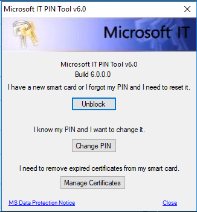
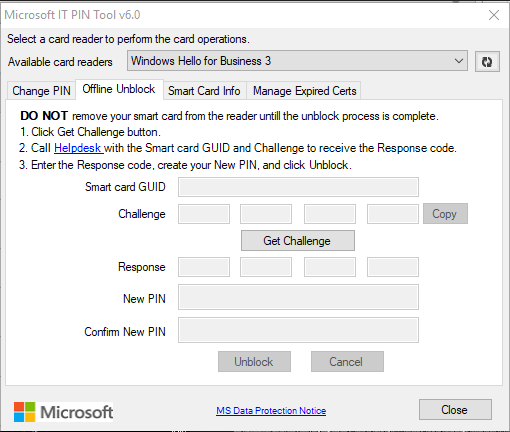
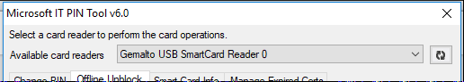
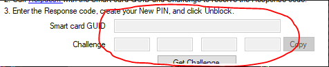
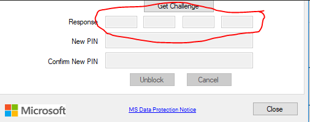

# Unblock card

- Go to [https://cdocidmrequestdevelop.azurewebsites.net/](https://cdocidmrequestdevelop.azurewebsites.net/), login with your corp account

- Select "Smart Card / YubiKey" on the left

- Select "Pin Unblock" on the new menu

- Follow the steps

- Once done, keep your Microsoft Teams open and you'll be contacted

- Once contacted, will ask you to run an authentication app (built-in with windows) to authenticate and prove your identity.
The CDOC team complete these requests **only between 06:00-10:00 (PST - Pacific Standard Time) - which is 16:00 - 20:00 (IST - Israel Standard Time)**

# Unblock tool (Microsoft IT PIN Tool)

- Connect a Smart-card reader to your PC

- Insert your card to the reader (the card's metal interface should be on top as you input it)

- You open the **Microsoft PIN Tool v7.0** (is the current latest, as of May 2020) (screenshot below are from earlier version)

- Click "Unblock" button

- Select 'Offline Unblock' (don't enter your username + password, as you are not unblocking CORPNET domain, but AME)
	
- You should see the Offline Unblock tab:

- Under available card readers, make sure that your smart card is selected (if you are using the regular mobile smart-card reader you were given as an employee, then you should see "Gemalto USB SmartCard Reader 0".
   - If you do not see your smart-card reader, then click on the Refresh button at the right and wait for the system to-redetect your card.
   - If you don’t see your card after refresh, make sure the card is inserted correctly (the metallic interface should be on top, and the card inserted all the way to the end)
   

   
<image>

- Follow the tab's instructions:
   - Click on "Get Challenge" button
   - Wait until you see challenge info displayed for:
      - Smart card GUID (generated GUID for your smart card should appear there)
      - Challenge (you should see challenge info in the 4 text-boxes)

	  
   - Click on "COPY"
   - Paste the answer in your Teams conversation with the IT Personnel.
   - They will send you a response to input. Enter the response in the boxes below the "Get Challenge" button.
   

   - Type in a new PIN code of your choice in the matching text boxes.
   - Click "Unblock"
   - You should get a confirmation message if the process completed successfully.

