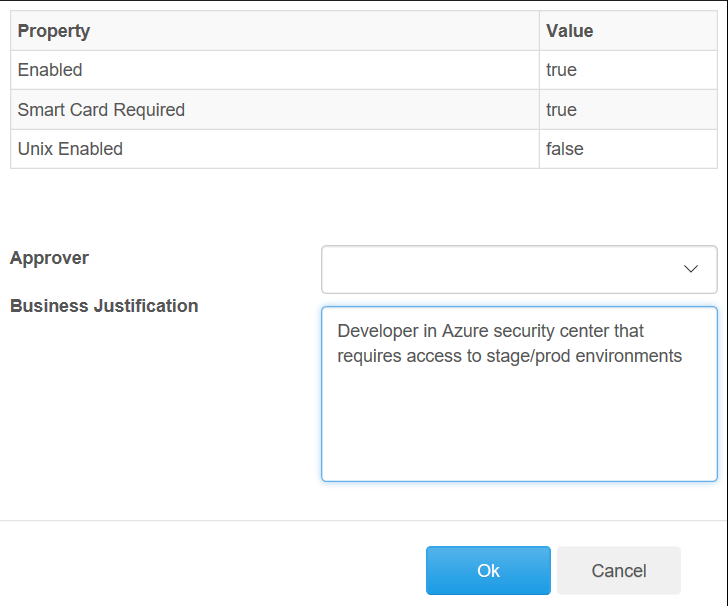

# General

If you don't have a SAW machine yet, ask our Security owner or your manager to follow this guide and create the account on your behalf.
If you already have a SAW machine, do it yourself.
This step is required before ordering a SAW machine, but you may already have one if you had an AME account that got revoked.

# Guide

- From SAW, go to [https://oneidentity.core.windows.net/](https://oneidentity.core.windows.net/)
	
- Under "**User Accounts**", click "**Create Request**"

- Select "**AME**" domain and type the required alias (similar to the corp alias)

- Verify "Unix Enabled" is **false** and click on **Create**

- Verify info by:
  - Enabled = **true**
  - Smart Card Required = **true**
  - Unix Enabled = **false**

- Select Approver (make sure the manager of the relevant employee is selected)

- Supply appropriate **Business Justification** (you can use: "Developer in Azure security center that requires access to stage/prod environments")

- click "**OK"

- If the request was successful, you should see the following

- Now, the employee's manager will get an email asking to approve the request

- You can click on "**View Requests**" to track the progress

