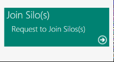
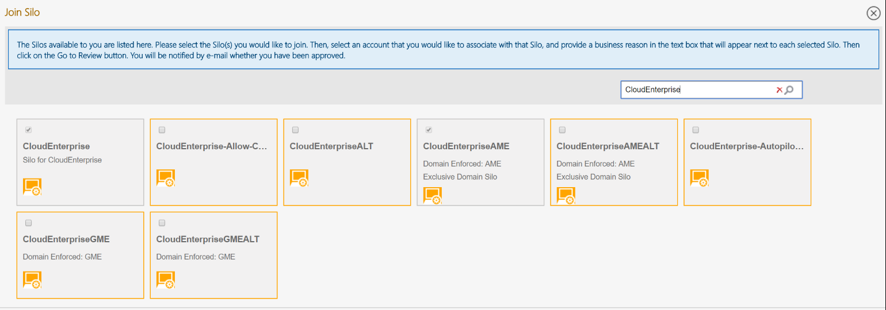
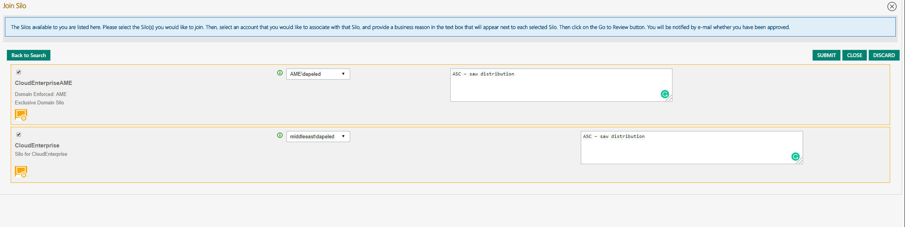

# General

A SILO is a repository of GPO (group policy objects) rules that get downloaded to your SAW machines when you log in to it.
The GPOs are responsible for creating all the restrictions and safeties to make the SAW a hardened working station (ex. Disabling your ability to be a local admin on your device).

# Prerequisites

You have [AME account](Create-AME-Account.md)

# Join SILO

- Go to [https://sasweb.microsoft.com/Member](https://sasweb.microsoft.com/Member)

- Click on "Join Silo"

- Type in the Silo name in the search box and check them (by using the checkbox). For initial setup, you need those (later you may need more):
	- CloudEnterprise
	- CloudEnterpriseAME
	- (If you'll have to use the ALT account of any of your identities in the future, you'll have to join matching "CloudEnterprise**X**" silo)

- Click "Go To Review" (on the right)

- Select the matching identity to log in as from the drop-down list
	- For AME Silo(s) - AME account
	- For non-AME - corp account
	

- Provide justification - "ASC – saw distribution"

- Click "Submit"

- You should receive an email with a confirmation