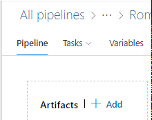

# General instructions for pipelines

OneBranch release wiki: [http://aka.ms/onebranchrelease](http://aka.ms/onebranchrelease)

Creating Release Definitions: [https://onebranch.visualstudio.com/onebranch/_wiki/wikis/OneBranch.wiki/1262/Creating-Release-Definitions](https://onebranch.visualstudio.com/onebranch/_wiki/wikis/OneBranch.wiki/1262/Creating-Release-Definitions)

# LX specific instructions

https://onebranch.visualstudio.com/onebranch/_wiki/wikis/OneBranch.wiki/1279/Creating-a-new-Release-(LX-Specific)

# Change existing steps

Deployment for USNat / USSec requires "cloudvaultv3" artifact to be used.

If your pipelines not already uses cloudvaultv3 artifact, please add one:

- Go to your pipeline -> edit (Url for example: https://dev.azure.com/msazure/One/_releaseDefinition?definitionId=XXX&_a=environments-editor-preview)

- Near "Artifacts" choose "+ Add" then "CloudVault v3" and follow required information (the information is a bit different between corext / cdpx repos)
	

After adding, you need to start actually using this artifact. Two options for that:

- (Assuming you're now on CloudVaultV2) Go to the old artifacts, copy the alias of it, remove the artifact, go to the new artifact, give it the same alias

- Change every existing step to use this artifact instead of the old one

	For doing that:

	- Edit each step by choosing it under "Tasks" on the upper menu

	- In the EV2 step, change the "Service Root Path" and "Rollout Spec Path" to use the new artifact (select the "…" and browse to the correct path)
	
	  Values expected to be very similar, except the artifact alias.
	  
	  For example, in DNS Bootstrap project the old artifact path was:
	
	  \$(System.DefaultWorkingDirectory)/ArtifactName/drop/outputs/build/output/DNSZones/bin/Release/net462/ServiceGroupRoot
	
	  And the new one is:
	
	  \$(System.DefaultWorkingDirectory)/ArtifactName/outputs/build/output/DNSZones/bin/Release/net462/ServiceGroupRoot
	
	- Once done, please delete the old artifact from the pipeline

		
# Adding USNat / USSec steps

The easiest way to start adding a LX stage, will be to clone existing stage / prod stages.

After doing it, you should edit the new stage and do the following changes:

- Stage name: change to "USNat: Dev" or "USNat: Prod" or "USSec: Prod"

- Pre-deployment conditions: During tests, change the trigger to be "Manual only". After all works - change the usnat/ussec prod stage it to be after both FF and MC prod.

- Edit the task itself (Choose "Tasks" on the top and then edit each relevant stage separately)

	- Approval service task -> Change "approval environment" (to be USNat or USSec)

	- Express V2 (MSInternal) -> Change "environment" (to the same as above)

	- In the "Agent Job" part, after the ev2 task, add "OneBranch - AirGapped Release" task with default settings (it may happen automatically once you'll save. You can try save, refresh and check or just add it…)
	
- In the variables tab, add the below variables

| Key | Value | Scope | Comment
|-----------|-----------|-----------|-----------|
CvrpManifestRelativePath | Path to your cvrp file (see below) | 	USNat: Prod / USSec: Prod | If you created separated cvrp file for usnat and ussec - you need to match the scope. Otherwise you can use the global "release" scope as mentioned
CustomDownloadPath | \\portal.gbl\public\USNat\WARM\Builds | USNat: Prod | Duplicate this line for each written scope, if you have deployment for the relevant environment in your pipe
CustomDownloadPath | \\portal.gbl\public\USSec\WARM\Builds | USSec: Prod | Duplicate this line for each written scope, if you have deployment for the relevant environment in your pipe

- For each stage env and prod env part, please apply all relevant pre/post deployment conditions (for example, pre-deployment approval)

# cvrp file path

For cdpx based repos, value is "default.cvrp".

For CoreXT based, see examples: [here](https://dev.azure.com/msazure/One/_git/Rome-Detection-Deployment/pullrequest/2716452?_a=overview), [here](https://dev.azure.com/msazure/One/_git/Rome-Detection-AlertSelector/pullrequest/2863579) or [here](https://dev.azure.com/msazure/One/_git/Rome-Detection-AlertDispatcher/pullrequest/2866020) and documentations [here](https://onebranch.visualstudio.com/Build/_wiki/wikis/Build.wiki/164/Build-Composition), [here](https://onebranch.visualstudio.com/Build/_wiki/wikis/Build.wiki/165/Build-Composition-Project-Setup) and [here](https://onebranch.visualstudio.com/Release/_wiki/wikis/CloudVault%20Wiki/749/Sovereign-Cloud-Replication?anchor=using-the-cloudvault-client-to-download-a-full-build-without-a-manifest)