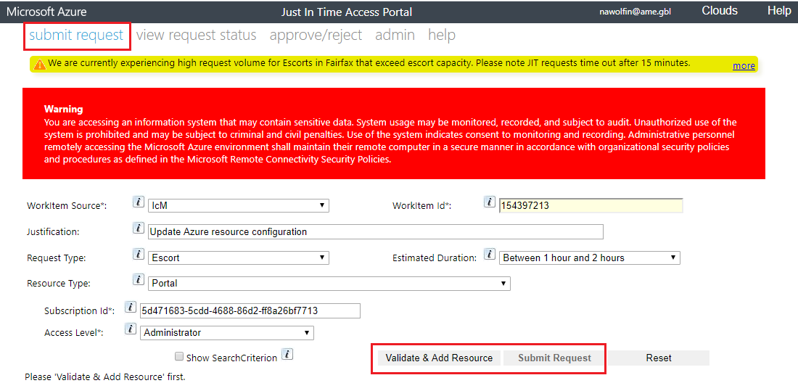

# JIT to sovereign cloud

## General

JIT in the context of sovereign clouds is used in order to ask for escort session or direct access (where possible)

After sending the request, you'll need other team member to approve the request (unless you're primary / secondary oncall - in this case it will be auto approved).

After that, an operator will contact you using Microsoft Teams

## Submit a JIT request

You can do so in two different ways.
Both ways require you to do the specific steps from your SAW machine and login with your AME account.

### Using JIT portal
  - From your SAW machine, login-in to the relevant JIT portal: [FairFax](https://jitaccess.security.core.usgovcloudapi.net), [Mooncake](https://jitaccess.security.core.chinacloudapi.cn) 
  (In case the above link is not available, browse [https://aka.ms/jit](https://aka.ms/jit) to get the secondary portal link (login aka.ms page using MS account))
  - Submit a new JIT request and fill it as follow:

       
  - Pay attention to choose the correct **Subscription Id**. List of subscription ids can be found [here](../../Environments/Resources/Subscriptions.md)
  - Pay attention that the **Workitem Id** filed is actuly Id of an ICM ticket #154397213: [AutoApproval ICM Ticket - Don't Close](https://icm.ad.msft.net/imp/v3/incidents/details/154397213/home)

### Using Powershell

  - Get the latest JITShell from here: 	reddog\Builds\branches\git_security_jit_master_latest\RDTools\WAPD\JITShell
    (In case the above share is broken, find the latest PS version in [https://aka.ms/jit](https://aka.ms/jit) and update this doc)
  - Copy the JITShell folder to your local C:\JITShell folder
  - Get and run the powershell script from our share folder:   
	
| Cloud Environment | Link
|-----------|-----------|
Fairfax | \\\romedetection\Share\Tools\JITshell\Fairfax
Mooncake | \\\romedetection\Share\Tools\JITshell\Mooncake
	
	This script uses JITShell and passing it the correct values for Detection team.
	
  The content of this PS should looks like that:

It should looks like that:

```
[System.AppContext]::SetSwitch("Switch.System.IdentityModel.DisableCngCertificates", $false)
Import-Module C:\JITshell\JITShell.dll
$id = New-JITRequest -env ff -src icm -wid <value> -Justification <value> -rtype Portals -subId <value> -AccessLevel Administrator -ver 2015-09-07.1.0 -EscortAccess $true
Get-JITRequest -env ff -ver 2015-09-07.1.0 -RequestId $id
```

Values for the Powershell are identical to those described above, in the portal option

run the specific file, according to the environment you need (stage / prod)

## Approving a JIT request
As written before, JIT requests need to be approved by a team member.

In order to approve a request, login to the same JIT portal described above, browse to "approve/reject" tab and approve.

The portal should be aligned with the portal that the requests sent from (primary / secondary). Requests sent from the Powershell are using the primary portal endpoint.


# Additional Notes regarding Escort session
  - If you wish to make changes in our Kusto cluster, please use the following link to open access to Kusto: https://ascprodffx.kusto.usgovcloudapi.net/