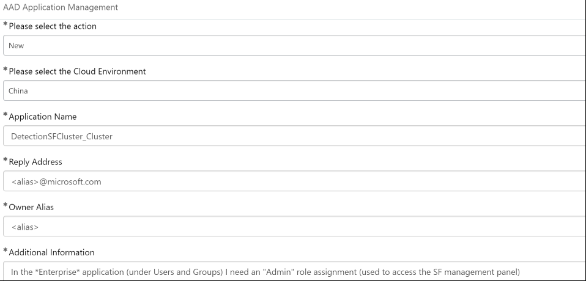

# ServiceFabric Permissions In Mooncake 

Prerequisite: Create a CME account

Link: [Cedis](https://microsoft.service-now.com/sp?id=sc_cat_item&sys_id=45cf48f613ebb68001ee7b104244b04d)

Fill in the form as follows:

Additional Information field:
"In the *Enterprise* application (under Users and Groups) I need an "Admin" role assignment (used to access the SF management panel)"

Submit the form.

In the created form add your manager’s alias in the users to notify text box at the bottom of the form.
(you'll need to send the request link to your manager and ask him to write "I approve this request").
